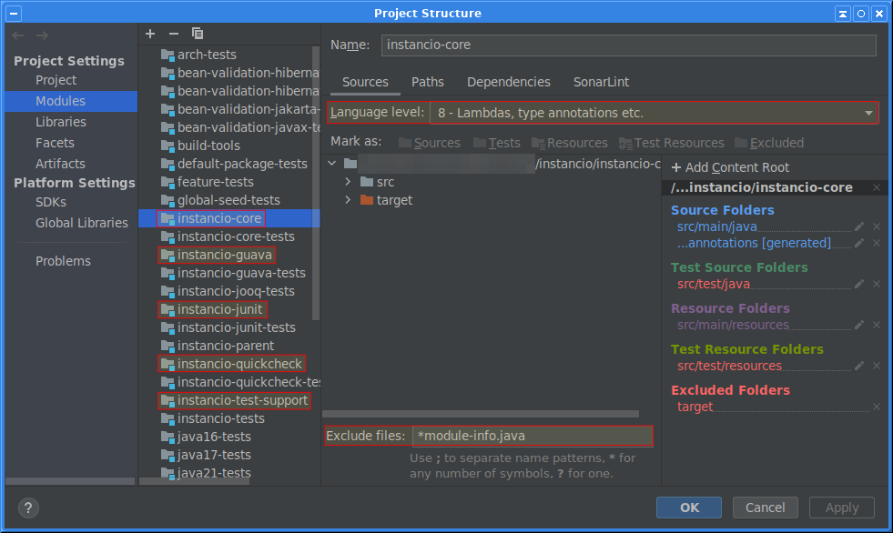

---
hide:
  - navigation
  - toc
---

# Building From Sources

Instancio is packaged as a [multi-release JAR](https://openjdk.java.net/jeps/238).
It can be used with Java 8 or higher.
Building Instancio from sources requires JDK 23 or higher:

```sh
git clone https://github.com/instancio/instancio.git
cd instancio
mvn verify
```

Currently, IntelliJ IDEA does not support multi-release projects very well
(see [IDEA-168946](https://youtrack.jetbrains.com/issue/IDEA-168946/Add-support-for-building-Java-9-multi-release-jars)).

If you encounter module-related errors when importing the project into the IDE,
apply the following changes to all highlighted modules.
Go to **`File -> Project Structure`**:

 - set the **Language level** to Java 8
 - exclude `module-info.java`

!!! note
    These changes are not permanent.
    If IntelliJ reloads Maven modules, these changes will be lost and will need to be set again.



# Building the Website

This site is built using <a href="https://www.mkdocs.org">MkDocs</a>
and <a href="https://squidfunk.github.io/mkdocs-material">MkDocs Material</a> theme.

To build the site, you will need the following Python packages:

```sh
pip install mkdocs \
    mkdocs-material \
    mkdocs-macros-plugin \
    mkdocs-autolinks-plugin \
    mkdocs-minify-html-plugin
```

To run the site locally: `cd website && mkdocs serve`. To generate static HTML: `mkdocs build`.